# ModCloth HipChat emoticons

We've expanded on the core set of [emoticons included with HipChat](http://hipchat-emoticons.nyh.name) and added our own.
Some of these were lifted from [emoticonHQ](http://emoticonhq.com/skypeemoticons.html) and [FourKitchens](https://github.com/fourkitchens/hipchat-emoticons).
Also, let the [EZgif animated GIF resizer](http://ezgif.com/resize) become your friend!

[April/2015]
Latest hipchat emoticon news is the size limit has been expanded to max size of 120px by 120px, minimum size of 64px by 64px and the number of custom emoticons upped to 100!

Source images have all been resized to minimum width of 64px and all saved as GIF.  This increase in size allows it to be uploaded to HipChat's Admin console.

## Emoticons

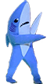 (leftshark)

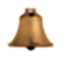 (accepted)
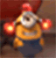 (alert)
 (ambulance)
 (angry)

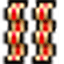 (bacon)
 (bandit)
 (billnye)
 (bluesteel)

 (blush)
 (borg)
 (bow)
 (brb)

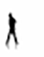 (breakdance)
 (bueller)
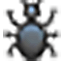 (bug)
 (bushes)

 (callme)
 (clap)
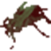 (crickets)
 (crying)
 (dancing)

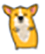 (dancingcorgi)
 (devil)
 (disapprovingkari)
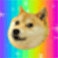 (doge)

 (doh)
 (drunk)
 (dude)
 (dull)

 (emo)
 (ermygerd)
 (fixit)
 (flex)
 (giggle)
 (hack)

 (handshake)
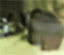 (headbang)
 (heartbeat)
 (inlove)

 (koger)
 (lifeishard)
 (macatoontown)
 (michaelscott)

 (modcloth)
 (n)
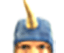 (narwhal)
 (nerd)

 (nod)
 (nomnom)
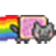 (nyancat)
 (oreo)

 (party)
 (penguin)
 (pharrell)
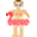 (poolparty)

 (puke)
 (rain)
 (rip)
 (rock)
 (rofl)

 (shake)
 (shipit)
 (shipitgood)
 (shocked)

 (sick)
 (smoking)
 (steelymcbeam)
 (sun)
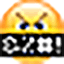 (swear)

 (sweating)
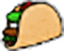 (taco)
 (tmi)
 (tofu)

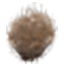 (tumbleweed)
 (udi)
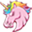 (unicorn)
 (wait)
 (walk)

 (wave)
 (whew)
 (winston)
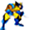 (wolverine)

 (worried)
 (y)
 (yawn)
 (x)

## Creating your own emoticons

We are using HipChat's built-in emoticon feature, which means an admin must upload the image in order for it to work. However, you can still create a pull request to get your icon into the repo, then let a HipChat admin know.

* Max dimensions are 120px tall and 120px wide
* Use a transparent PNG or animated GIF for best results
* Images must be under 1MB
* Currently limited to 100 custom emoticons

## Need more emojis?

From the chat window press `ctrl+cmd+space` to bring up the emoji window.
